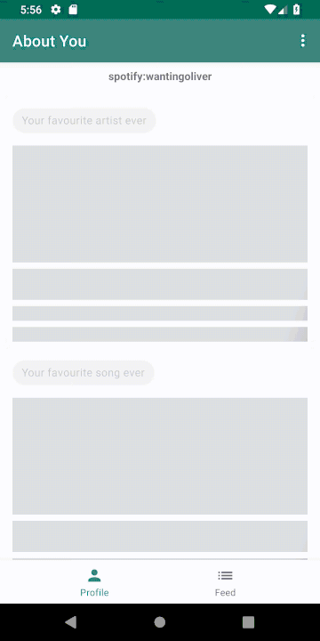
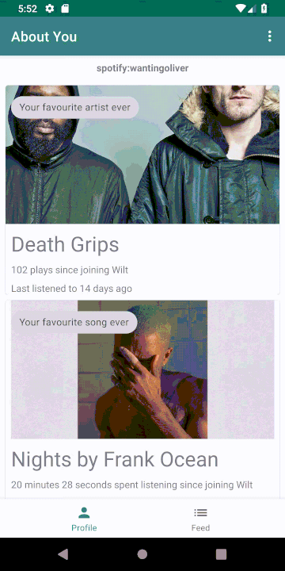
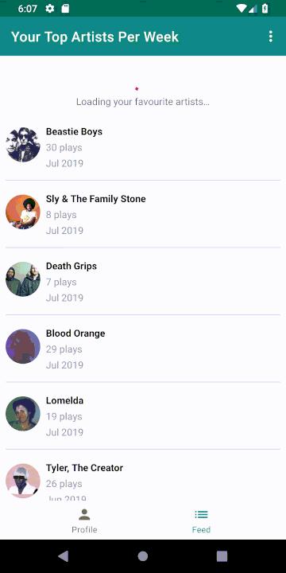

# Wilt - What I Listen To

[](https://travis-ci.org/oliveroneill/wilt-android)

This is an Android client for displaying Wilt metrics.

External project components:
- [Server-side and browser client](https://github.com/oliveroneill/wilt) (using Firebase and BigQuery)
- [iOS app](https://github.com/oliveroneill/wilt-ios)

## Installation
Create a file called `app/src/main/res/values/secrets.xml` with contents:
```xml
 <resources>
    <string name="spotify_client_id">ENTER-CLIENT-ID-HERE</string>
    <string name="spotify_redirect_uri">ENTER-REDIRECT-URI</string>
 </resources>
```
Put your `google-services.json` file in `app/`. Generate this file via the
Firebase console for Android integration.

## The app in action
(Apologies for the bad compression)





## TODO
- Change navigation to reuse fragments when navigating. This is a limitation
of Navigation component. See discussion
[here](https://issuetracker.google.com/issues/80029773)
